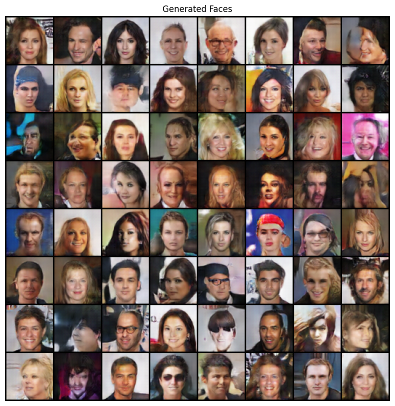
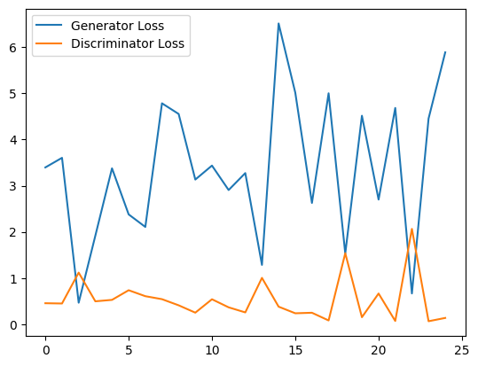

# DCGAN for Face Generation using CELEBA Dataset

## Introduction
This project implements a Deep Convolutional Generative Adversarial Network (DCGAN) to generate realistic face images using the CELEBA dataset. The model consists of a generator and a discriminator trained using PyTorch.

## Dataset Preprocessing Steps
1. Download the CELEBA dataset from Kaggle.
2. Resize and normalize images to 64x64 resolution.
3. Convert images to tensors and normalize pixel values to the range [-1, 1].
4. Load dataset using PyTorch's DataLoader for efficient batch processing.

## Training the Model
1. Set hyperparameters such as batch size, learning rate, and number of epochs.
2. Initialize the generator and discriminator networks.
3. Define loss functions and optimizers.
4. Train the model for a specified number of epochs:
   - Train the discriminator to distinguish real and fake images.
   - Train the generator to produce realistic images that fool the discriminator.
5. Save the trained models (`generator.pth`, `discriminator.pth`).
6. Generate and save images after each epoch to track progress.

## Testing the Model
1. Load the trained generator model.
2. Generate new images using random noise as input.
3. Save and visualize the generated images.

## Expected Outputs
- The model will generate realistic human faces over time.
- Loss curves will show the generator and discriminator losses decreasing and stabilizing.

### Example Generated Image

### Loss Curve

## Requirements
- Python 3.x
- PyTorch
- torchvision
- Matplotlib
- PIL
- Kaggle API (for dataset download)

## How to Run
1. Clone this repository.
2. Install dependencies: `pip install -r requirements.txt`
3. Run the training script: `python train.py`
4. To generate new images using the trained model: `python generate.py`

## Conclusion
This project demonstrates how DCGANs can be used for face generation using the CELEBA dataset. With sufficient training, the generator can produce realistic human faces from random noise.

---

Feel free to modify or extend this project for further improvements!
